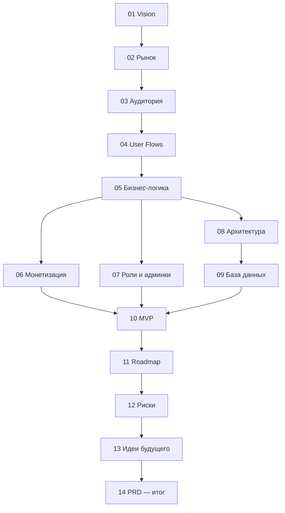

# 00 · Обзор документации и глоссарий

## Как читать эту документацию

Документы пронумерованы в порядке, повторяющем логику продуктового анализа: от видения → к рынку → к пользователям → к сценариям → к бизнес-логике → к архитектуре → к плану. Если нужна быстрая выжимка — читайте сразу [PRD (документ 14)](14-prd.md), в нём собраны финальные решения; остальные документы объясняют, *почему* эти решения приняты.

## Принципы, принятые во всей документации

1. **Сначала бизнес, потом технологии.** Конкретный стек технологий в документах намеренно не фиксируется — архитектура (док. 08) описана концептуально. Выбор стека — отдельное решение после утверждения PRD.
2. **Честность к идее.** Слабые места идеи не замалчиваются — они вынесены явно (см. врезки «⚠️ Слабое место» и документ 12).
3. **Маркетплейс — это два продукта.** У Padelio два клиента: игрок и клуб. Провал на любой стороне убивает продукт. Поэтому каждый раздел рассматривает обе стороны.
4. **Единственный часовой пояс.** Продукт стартует в Ташкенте (UTC+5, без перехода на летнее время), но время везде проектируется как «время клуба», а не «время сервера» — это защищает от проблем при экспансии.

## Глоссарий

| Термин | Значение |
|---|---|
| **Падел (padel)** | Ракеточный спорт 2×2 на корте 10×20 м со стеклянными стенами. Самый быстрорастущий вид спорта в мире. |
| **Клуб** | Заведение с одним или несколькими падел-кортами. Партнёр платформы. |
| **Корт** | Отдельная игровая площадка внутри клуба (indoor/outdoor, одиночный/парный). |
| **Слот** | Минимальная единица бронирования: конкретный корт + конкретный интервал времени (обычно 60 или 90 минут). |
| **Бронь (Reservation)** | Зафиксированное за пользователем право играть в конкретном слоте. |
| **Hold (удержание)** | Временная блокировка слота на время оформления оплаты (5–10 минут). |
| **No-show (неявка)** | Пользователь не пришёл на подтверждённую бронь и не отменил её. |
| **Mini App (TMA)** | Telegram Mini App — веб-приложение, открывающееся внутри Telegram. |
| **Платформа** | Padelio как сервис; «администратор платформы» — наша команда. |
| **Владелец клуба** | Пользователь с правами управления клубом: тарифы, расписание, сотрудники, финансы. |
| **Админ клуба** | Сотрудник клуба: подтверждение оплат на месте, отметка прихода, работа с бронями. |
| **GMV** | Gross Merchandise Value — суммарная стоимость всех броней, прошедших через платформу. |
| **Take rate** | Доля GMV, которую платформа берёт как комиссию. |
| **Прайм-тайм** | Часы пикового спроса (будни 18:00–23:00, выходные days). |
| **Офф-пик** | Часы низкого спроса (будни утро/день). |

## Карта документов

