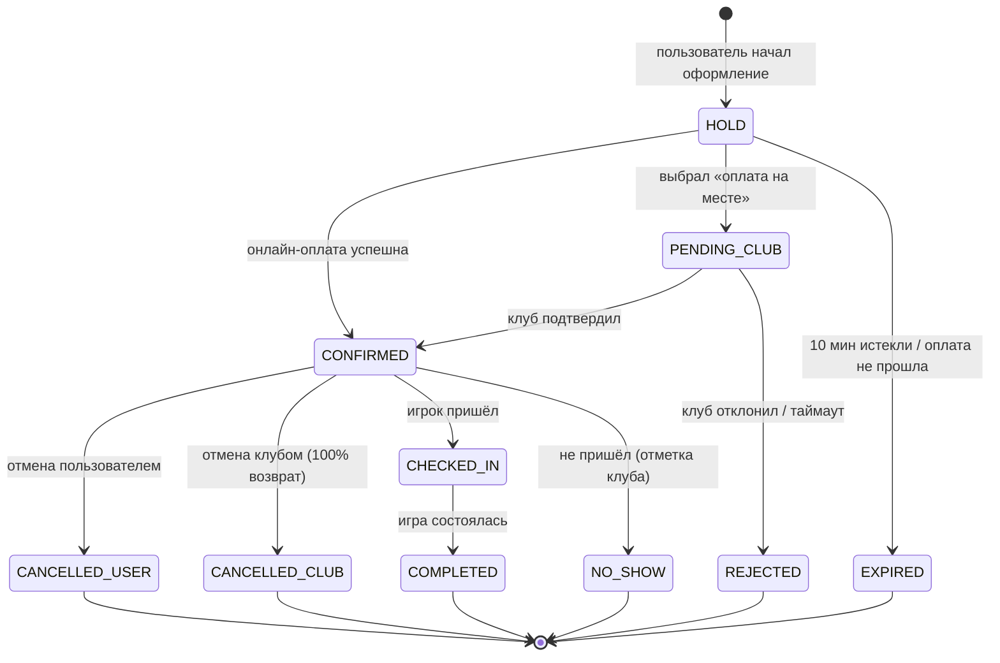

# 04 · User Flows: сценарии, состояния, ошибки

## 0. Принципы UX

1. **«3 тапа до корта»** — целевой happy path для повторного пользователя: открыть → выбрать слот → оплатить.
2. **Карта + список равноправны.** ⚠️ Ревизия исходной идеи: при 10–30 клубах карта как *единственный* главный экран неэффективна (пользователю чаще важно «когда свободно», а не «где на карте»). Главный экран = переключатель «Список / Карта» + глобальный фильтр по дате/времени. Список отсортирован по релевантности (расстояние, рейтинг, наличие слотов на выбранное время).
3. **Поиск от времени, а не только от клуба.** Два входа в бронирование: «выбрал клуб → смотрю его время» и «выбрал время → вижу, где свободно». Второй сценарий — уникальное преимущество агрегатора, статус-кво его не умеет.
4. **Каждое состояние спроектировано.** Для каждого экрана определены: loading / empty / error / offline / success.
5. **Язык:** узбекский / русский / английский, выбор при первом входе (по `language_code` Telegram — предзаполнение), переключение в профиле.

---

## 1. Первый запуск (онбординг)

```
Telegram → пользователь находит бота (реклама, QR в клубе, ссылка от друга, поиск)
→ /start (с deep-link-параметром: ?start=ref_XXX / club_YYY / match_ZZZ)
→ Бот: приветствие 1 сообщением + кнопка «Открыть Padelio» (открывает Mini App)
→ Mini App: автоавторизация через Telegram initData (без логина/пароля!)
→ Выбор языка (предзаполнен) → 2 экрана онбординга (карта клубов, как работает бронь) с «Пропустить»
→ Главный экран
```

**Запрос номера телефона** — НЕ при входе, а лениво: перед первой бронью (кнопка Telegram «Поделиться номером»). Причина: каждый лишний шаг на входе режет конверсию; номер нужен клубу, а не нам для просмотра.

**Deep-links (обязательны с MVP):**
- `?start=club_{id}` — QR-код на стойке клуба → сразу карточка клуба;
- `?start=res_{id}` — ссылка-шеринг брони → карточка брони (для друзей);
- `?start=ref_{code}` — реферальная ссылка → активация бонуса;
- `?start=match_{id}` — приглашение в открытый матч.

**Исключения:** initData невалидна → экран «Откройте через Telegram» + кнопка перезапуска; нет сети → offline-экран с retry; техработы → экран-заглушка с ETA.

---

## 2. Главный экран (Discovery)

**Элементы:** строка выбора даты/времени («Сегодня 19:00–21:00» по умолчанию: ближайший вечер); переключатель Список/Карта; фильтры (район, цена, indoor/outdoor, услуги: душ/парковка/аренда/кафе/тренер, «есть свободные слоты»); карточки клубов (фото, рейтинг, расстояние, цена «от», бейдж «есть время сегодня»); нижняя навигация: **Играть / Мои брони / Матчи / Профиль**.

**Карта:** пины клубов с ценой «от»; кластеризация не нужна при <50 объектах; геолокация по разрешению (fallback — центр Ташкента); тап по пину → мини-карточка → полная карточка.

**Состояния:** loading — скелетоны карточек; empty (фильтры слишком узкие) — «Ничего не нашлось» + кнопка «Сбросить фильтры» + ближайшие альтернативные слоты; error — retry; геолокация запрещена — сортировка по рейтингу с ненавязчивой подсказкой.

---

## 3. Карточка клуба

**Блоки (сверху вниз):** галерея фото → название, рейтинг ★4.8 (127), район и расстояние → **виджет ближайших свободных слотов на сегодня (главный CTA)** → календарь-расписание (7–14 дней вперёд) → цены (прайм/офф-пик, будни/выходные) → услуги-иконки (парковка, душ, кафе, аренда ракеток/мячей, раздевалка, кондиционер, трибуны) → корты (список: №, indoor/outdoor, покрытие, панорамное стекло) → тренеры (аватар, цена, кнопка «Записаться») → отзывы (последние 3 + «все отзывы») → адрес, мини-карта, кнопка **«Маршрут»** (открывает Яндекс.Карты/Google Maps/2GIS через deep-link с выбором) → контакты (звонок, Telegram клуба) → часы работы, правила отмены клуба.

**Состояния:** клуб временно не принимает брони («Приём броней приостановлен» + телефон); клуб закрыт в выбранную дату; нет фото — плейсхолдер; нет отзывов — «Станьте первым».

---

## 4. Выбор слота и оформление брони (ядро продукта)

### 4.1. Выбор слота

```
Календарная лента дат (14 дней) → сетка: строки = корты, столбцы = время (или список слотов, если корт «любой»)
Слот: [свободен - цена] [занят] [ваш] [прошёл] [заблокирован клубом] [held - «кто-то оформляет»]
→ Тап по слоту → выбор длительности (60/90/120 мин, если следующие слоты свободны)
→ Допродажи: аренда ракеток (шт), мячи, [опц.] тренер
→ Кнопка «Продолжить»
```

Расписание обновляется в реальном времени (см. док. 08); при открытом экране слоты, занятые другими, сереют без перезагрузки.

### 4.2. Подтверждение и оплата

```
Экран подтверждения: клуб, корт, дата, время, длительность, допуслуги, промокод (поле), итог
→ [Если номер не сохранён: запрос телефона через Telegram]
→ Выбор способа оплаты:
   A. Онлайн (Payme / Click / Uzum / карта) — БРОНЬ ГАРАНТИРОВАНА СРАЗУ
   B. Оплата на месте (если клуб разрешил) — бронь уходит клубу на подтверждение
→ Нажатие «Оплатить» ⇒ создаётся HOLD слота на 10 минут (никто другой не может его занять)
→ A: редирект в платёжку → успех → бронь CONFIRMED → экран успеха
→ B: бронь PENDING_CLUB → пуш админу клуба → подтверждение → CONFIRMED
```

**Экран успеха:** большая галочка, детали брони, QR-код/код брони (называется на ресепшене), кнопки: «Добавить в календарь», «Поделиться с друзьями» (форвард в чат), «Маршрут», «Открыть матч для других игроков» (фаза 2), «Разделить оплату» (фаза 2).

### 4.3. Все исключительные ситуации бронирования

| # | Ситуация | Поведение системы |
|---|---|---|
| E1 | Слот заняли, пока пользователь смотрел экран | При тапе: «Это время только что заняли» + автопредложение ближайших альтернатив (±1 час, соседний корт, соседний клуб) |
| E2 | Hold истёк (10 мин), пользователь завис на оплате | Слот освобождается; при возврате — «Время оформления истекло, слот мог освободиться» + повторная проверка |
| E3 | Оплата не прошла (отказ банка) | Бронь остаётся в hold до истечения; «Оплата не прошла» + повторить / сменить способ; 3 неудачи → предложить оплату на месте или поддержку |
| E4 | Оплата прошла, но колбэк платёжки потерялся | Фоновая сверка по интервалу; бронь не отменяется до выяснения; пользователю: «Проверяем оплату, ответим в течение N минут»; деньги никогда не теряются молча (док. 12) |
| E5 | Двойной тап «Оплатить» / повторный запрос | Идемпотентность по ключу операции — вторая попытка возвращает первую бронь, а не создаёт дубль |
| E6 | Клуб не подтвердил «оплату на месте» за 2 часа (или за 30 мин, если игра скоро) | Автоотмена PENDING_CLUB, уведомление пользователю с альтернативами; клубу — минус в метрику отклика |
| E7 | Пользователь пытается бронировать в прошлом / за пределами горизонта | Слоты недоступны для выбора; горизонт бронирования настраивается клубом (по умолчанию 14 дней) |
| E8 | Пересечение с собственной бронью | Предупреждение «У вас уже есть игра в это время», но не блокировка (мог бронировать для друзей) |
| E9 | Лимит активных броней (антиспам, по умолчанию 3–5 у нового пользователя) | «Достигнут лимит активных броней»; лимит растёт с доверием (историей явок) |
| E10 | Промокод невалиден/истёк/не для этого клуба | Инлайн-ошибка у поля, бронь не блокируется |
| E11 | Клуб заблокировал слот после начала оформления | Hold отклоняется: «Время стало недоступно» + альтернативы |
| E12 | Цена изменилась между показом и оплатой | Цена фиксируется в hold — оплата всегда по показанной цене |

---

## 5. «Мои брони» и жизнь брони

**Список:** Предстоящие / Прошедшие. Карточка: клуб, корт, время, статус, сумма.

**Экран брони:** детали, QR-код, участники (если раздельная оплата/матч), кнопки по статусу:
- CONFIRMED, до игры > порога отмены: «Отменить» (с явным показом суммы возврата по правилам клуба), «Перенести» (= отмена+новая бронь атомарно), «Поделиться», «Маршрут», «Позвонить клубу»;
- CONFIRMED, до игры < порога: «Отменить (без возврата / частичный)» с честным предупреждением;
- в лист ожидания встал: «Вы 2-й в очереди» + «Покинуть очередь»;
- после игры: «Оценить клуб» (одноразово), «Повторить бронь» (тот же клуб/корт/время на следующую неделю — одним тапом).

**Уведомления по броням** — полный список в док. 05 §12.

---

## 6. Отмена и возврат (flow пользователя)

```
«Отменить» → экран: правила клуба + расчёт возврата («Вернём 200 000 сум на карту в течение 1–3 дней»)
→ Причина отмены (опционально, для аналитики) → Подтверждение (двойное!)
→ Бронь CANCELLED → возврат запускается автоматически → слот освобождается
→ Если на слот был лист ожидания → мгновенный пуш первому в очереди
```

Исключения: возврат не прошёл на стороне платёжки → тикет в поддержку автоматически, пользователю — статус «Возврат обрабатывается»; отмена *клубом* → 100% возврат всегда + извинение + промокод-компенсация + приоритетные альтернативы.

## 7. День игры

```
За 24 ч: напоминание с прогнозом погоды (для outdoor) и кнопкой «Всё в силе / Отменить»
За 2 ч: напоминание + маршрут + код брони
Приход: админ находит бронь (QR или имя) → отмечает check-in [+ принимает оплату, если на месте]
Не пришёл: через 15 мин после старта админ может отметить no-show (см. док. 05 §5)
После игры (через ~1 ч после конца): «Как поиграли?» → оценка ★ + отзыв + чаевые тренеру (фаза 3)
```

## 8. Flow администратора клуба (кратко; полностью — док. 07)

Вход в тот же Mini App → система видит роль → режим клуба: экран «Сегодня» (сетка кортов × время), тап по пустому слоту → быстрая бронь (имя+телефон), тап по брони → check-in / оплата на месте / отмена / no-show; блокировка слотов; завтра/календарь; поиск по телефону. Критичный сценарий: **телефонный звонок в клуб** — админ создаёт бронь за ≤15 секунд, иначе клуб вернётся к тетради.

## 9. Прочие сценарии

- **Лист ожидания:** слот занят → «Встать в очередь» → при освобождении пуш первому → эксклюзивное окно 10 минут на оплату → не успел → следующему. (Логика — док. 05 §6.)
- **Открытый матч (фаза 2):** создать матч из брони → указать уровень и число мест → матч виден в разделе «Матчи» и шарится ссылкой → игроки присоединяются с оплатой своей доли → чат матча.
- **Реферал:** «Пригласи друга» → персональная ссылка → друг сыграл первую игру → бонус обоим (док. 05 §14).
- **Смена языка, управление уведомлениями, способы оплаты, удаление аккаунта** — в Профиле.
- **Жалоба:** на клуб/отзыв/игрока — из соответствующей карточки, форма с категорией; тикет модератору платформы (SLA 24 ч).

## 10. Сводная карта состояний брони


