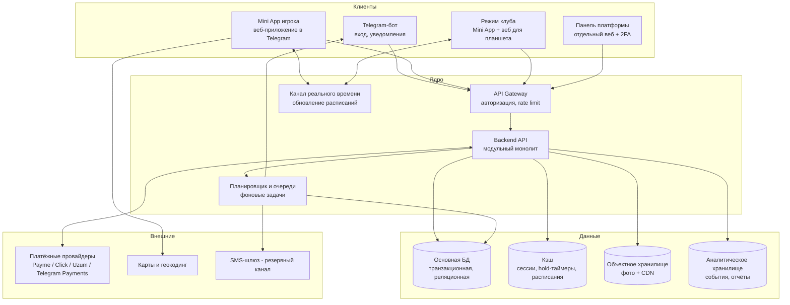

# 08 · Архитектура (концептуальная)

> По условию проекта конкретный стек технологий **не фиксируется** до завершения бизнес-анализа. Здесь описаны компоненты, границы, паттерны и требования — так, чтобы под них можно было выбрать любой зрелый стек. Критерии выбора стека — в конце документа.

## 1. Общая схема

## 2. Ключевые архитектурные решения (ADR-стиль)

### ADR-1. Модульный монолит, а не микросервисы
Нагрузка города Ташкента (сотни броней/день, пики — вечер) ничтожна для современного сервера. Микросервисы на старте = налог на скорость разработки маленькой команды. Решение: один деплоймент с жёсткими модульными границами (Booking, Catalog, Payments, Identity, Notifications, Reviews, ClubOps, Analytics) — внутренние интерфейсы позволяют выделить модуль в сервис позже (первый кандидат — Payments).

### ADR-2. Mini App = обычное веб-приложение
Telegram Mini App — это веб-страница, получающая `initData` от Telegram. Следствия: (а) код переиспользуем как обычный сайт/PWA — страховка платформенного риска Telegram; (б) режим клуба — то же приложение с ролевым роутингом; (в) обязательна серверная валидация подписи `initData` при каждой сессии.

### ADR-3. Источник правды по доступности — транзакционная БД
Никаких «расписаний в кэше как истина». Свободность слота проверяется и фиксируется в БД атомарно: **ограничение уникальности/исключения на пересечение интервалов по корту** — конфликт броней невозможен на уровне хранилища, а не приложения (см. док. 12 §1). Кэш — только ускоряющая проекция для чтения, инвалидируется событиями.

### ADR-4. Событийная модель внутри
Каждое изменение брони/платежа порождает доменное событие (`reservation.confirmed`, `slot.released`, `payment.failed`...). Подписчики: уведомления, лист ожидания, реальное время, аналитика, audit log. События хранятся (outbox-паттерн) — гарантия доставки и полный журнал для разбора споров.

### ADR-5. Платёжный модуль — изолированный и идемпотентный
Единый внутренний интерфейс `PaymentProvider` с адаптерами (Payme, Click, Uzum, Telegram Payments, «на месте»). Правила: идемпотентность всех операций (ключи), обработка колбэков «минимум дважды» (повторы провайдера), фоновая сверка статусов (reconciliation), автоматические возвраты, деньги считаются в минорных единицах (тийины), состояние платежа — конечный автомат. Держим и «ledger» — журнал двойной записи по кошельку.

### ADR-6. Время
Всё хранится в UTC; у клуба — поле `timezone` (старт: Asia/Tashkent, UTC+5, без DST). Показ — всегда в зоне клуба. Слоты определяются локальной датой+временем клуба и конвертируются на границе. Это делает экспансию в другие города безболезненной (док. 12 §7).

## 3. Компоненты

- **Telegram-бот:** тонкий: /start, deep-links, выдача кнопки Mini App, доставка уведомлений (через очередь с ретраями и учётом rate-limit Telegram), fallback-меню, «поделиться номером».
- **Mini App (игрок):** дискавери (список/карта), карточка клуба, бронирование, платежи (redirect/invoice), профиль. Требования: первая отрисовка < 2 с на среднем смартфоне, тёмная/светлая тема Telegram, i18n (uz/ru/en).
- **Режим клуба:** сетка дня в реальном времени, оффлайн-устойчивость (очередь действий при пропадании сети на стойке).
- **Реальное время:** подписка «расписание клуба на дату»: изменения слотов доталкиваются клиентам (websocket/SSE — выбор на этапе стека). Fallback — поллинг.
- **Планировщик/очереди:** истечение hold, таймауты подтверждения, напоминания (24ч/2ч), автозакрытие броней, продвижение листа ожидания, регулярные брони, сверка платежей, ретраи уведомлений.
- **Хранилище изображений:** объектное хранилище + CDN; загрузка по pre-signed ссылкам; серверная генерация размеров (thumb/card/full, webp); модерация фото перед публикацией; EXIF-очистка.
- **Аналитика:** поток продуктовых событий (просмотр → слот → hold → оплата → игра) в отдельное хранилище; дашборды платформы и клубов строятся из него, не нагружая основную БД.

## 4. Авторизация и безопасность

- **Игроки:** только Telegram `initData` (проверка HMAC-подписи, TTL, анти-replay) → короткоживущий сессионный токен. Номер телефона — через нативный запрос Telegram, верифицирован платформой.
- **Роли клуба:** инвайт-ссылки от владельца, привязка к Telegram ID; критичные операции (выплаты) — подтверждение.
- **Панель платформы:** отдельная аутентификация + обязательная 2FA, IP-аллоулист по возможности.
- **Общее:** TLS везде; секреты в менеджере секретов; rate limiting по пользователю и IP; валидация всех входных данных; RBAC-проверки на сервере (клиентские роли — только UI); audit log админ-действий; персональные данные — минимум (имя, телефон, Telegram ID), соответствие закону УЗ «О персональных данных» (локализация ПДн — юридическая проверка, см. док. 12 §9); резервные копии БД с проверкой восстановления; платёжные данные карт не храним вообще (только токены провайдеров).

## 5. Масштабируемость и отказоустойчивость

- Вертикальный запас монолита покрывает ×100 от стартовой нагрузки; горизонтальное масштабирование — stateless API за балансировщиком.
- Пики: вечер воскресенья (брони на неделю) и открытие горизонта — сглаживаются кэшем чтения расписаний.
- Деградация: платёжка упала → предлагать другой способ/оплату на месте; карты не грузятся → список; реальное время упало → поллинг. Ни один внешний сбой не должен полностью блокировать бронирование.
- Мониторинг: метрики бизнеса (брони/час, ошибки оплат) важнее метрик CPU — алерт «за час 0 броней в прайм-тайм» = инцидент.
- Мультигород/мультиспорт заложены в модель данных (city, sport_type), а не в код.

## 6. Критерии выбора стека (когда придёт время)

1. Скорость разработки маленькой командой и доступность разработчиков в найме (в т.ч. в УЗ).
2. Зрелые библиотеки: Telegram Bot API/Mini Apps, платёжные SDK Payme/Click/Uzum.
3. Реляционная БД с ограничениями на пересечение интервалов и надёжными транзакциями.
4. Один язык на клиент+сервер — плюс (общие типы контрактов API).
5. Стоимость хостинга и близость к пользователям (латентность из УЗ), поддержка CDN.
6. Простота найма поддержки на годы вперёд — скучные технологии лучше модных.
