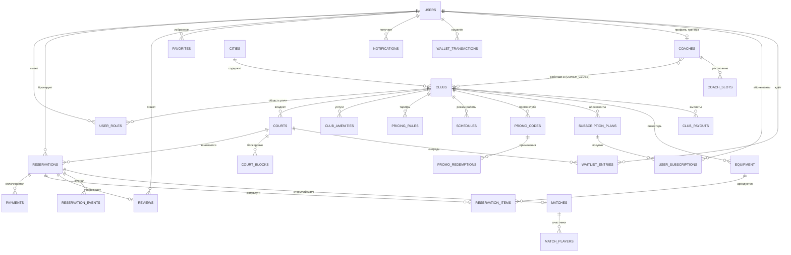

# 09 · Модель данных

> Логическая модель, независимая от конкретной СУБД. Все деньги — в минорных единицах (тийины), все временные метки — UTC, у клуба — timezone. Все таблицы: `id`, `created_at`, `updated_at`; мягкое удаление (`deleted_at`) для пользовательских данных.

## 1. ER-диаграмма (основные сущности)

## 2. Сущности

### Идентичность и роли
- **USERS** — `telegram_id` (uniq), `phone` (uniq, verified_at), `first_name`, `last_name`, `username`, `language` (uz/ru/en), `avatar_url`, `player_level` (1.0–7.0, nullable), `reliability_score` (внутр.), `no_show_count`, `referral_code` (uniq), `referred_by_user_id` (FK USERS), `wallet_balance` (денормализованный итог ledger), `notification_prefs` (json), `status` (active/restricted/banned).
- **USER_ROLES** — `user_id`, `role` (enum из док. 07), `club_id` (nullable — платформенные роли без клуба), `granted_by`, `granted_at`. Uniq: (user_id, role, club_id).

### Каталог
- **CITIES** — `name`, `timezone`, `center_lat/lng`, `is_active`. (Мультигород с 1-го дня.)
- **CLUBS** — `city_id`, `name`, `slug`, `description` (i18n json), `lat`, `lng`, `address` (i18n), `district`, `phone`, `telegram_contact`, `photos` (массив/связ. таблица), `rating_avg` (денорм.), `rating_count`, `cancellation_policy` (enum шаблона), `booking_horizon_days`, `slot_step_min`, `allow_pay_on_site` (bool), `confirm_timeout_min`, `status` (draft/active/paused/blocked), `commission_rate` (индивидуальная), `payout_details`, `working_hours` → SCHEDULES.
- **CLUB_AMENITIES** — `club_id`, `amenity` (enum: parking, shower, cafe, locker, racket_rent, ball_rent, ac, tribune, kids_zone…), `details`.
- **COURTS** — `club_id`, `name` («Корт 1»), `sport_type` (enum: padel, — задел под теннис/бадминтон), `indoor` (bool), `surface`, `has_panoramic_glass`, `photos`, `status` (active/maintenance/closed), `sort_order`.
- **SCHEDULES** — режим работы: `club_id`, `day_of_week` (0–6) или `special_date` (праздники/исключения), `open_time`, `close_time`, `is_closed`. Сетка слотов **генерируется на лету** из SCHEDULES + PRICING_RULES + занятости (RESERVATIONS + COURT_BLOCKS) — слоты не материализуются в таблицу (иначе миллионы пустых строк и боль при смене расписания).
- **PRICING_RULES** — `club_id`, `court_id` (nullable = все корты), `day_mask`, `time_from`, `time_to`, `price_per_hour`, `priority` (специфичные правила бьют общие), `valid_from/to` (сезонные цены), `is_dynamic_discount` (офф-пик промо), `discount_pct`.
- **COURT_BLOCKS** — блокировки: `court_id`, `starts_at`, `ends_at`, `reason` (maintenance/tournament/internal), `created_by`, `recurrence` (nullable).

### Бронирование
- **RESERVATIONS** — ядро системы: `court_id`, `club_id` (денорм. для отчётов), `user_id` (nullable для офлайн-брони), `guest_name`, `guest_phone` (для офлайн), `starts_at`, `ends_at` (UTC), `status` (hold/pending_club/confirmed/checked_in/completed/cancelled_user/cancelled_club/no_show/expired/rejected), `hold_expires_at`, `price_total`, `price_court`, `discount_total`, `promo_code_id` (FK), `subscription_id` (FK, если списано с абонемента), `payment_method` (online/on_site/wallet/mixed/subscription), `source` (miniapp/club_admin/recurring/waitlist), `cancellation_reason`, `checked_in_at`, `created_via_recurring_id`, `idempotency_key` (uniq). **Ограничение целостности: запрет пересечения интервалов `[starts_at, ends_at)` по `court_id` для активных статусов** — на уровне БД.
- **RESERVATION_ITEMS** — допуслуги брони: `reservation_id`, `type` (racket/balls/coach/other), `equipment_id`/`coach_id` (nullable), `qty`, `price`.
- **RESERVATION_EVENTS** — журнал (append-only): `reservation_id`, `event` (created/held/paid/confirmed/reminded/checked_in/…), `actor_type` (user/club/system/support), `actor_id`, `payload` (json), `at`. Источник правды для споров.
- **WAITLIST_ENTRIES** — `user_id`, `court_id` (nullable = любой корт клуба), `club_id`, `desired_start`, `desired_end`, `status` (waiting/notified/converted/expired/left), `position`, `notified_at`, `notify_expires_at`.
- **RECURRING_RESERVATIONS** — регулярные брони: `user_id`, `court_id`, `weekday`, `start_time`, `duration`, `auto_charge` (bool), `status`, `paused_until`.
- **MATCHES** (фаза 2) — открытые матчи: `reservation_id`, `host_user_id`, `level_min/max`, `seats_total`, `price_per_seat`, `status`; **MATCH_PLAYERS** — `match_id`, `user_id`, `payment_id`, `status` (joined/paid/left/kicked), `result_confirmed`.

### Деньги
- **PAYMENTS** — `reservation_id` (nullable: сертификаты, абонементы, подписки), `user_id`, `amount`, `currency` (UZS), `provider` (payme/click/uzum/telegram/on_site/wallet), `provider_txn_id`, `status` (created/pending/succeeded/failed/refund_pending/refunded/partially_refunded), `idempotency_key` (uniq), `paid_at`, `error_code`, `raw_callback` (json, для разборов).
- **REFUNDS** — `payment_id`, `amount`, `reason`, `initiated_by`, `status`, `provider_refund_id`.
- **WALLET_TRANSACTIONS** — ledger (двойная запись): `user_id`, `amount` (±), `type` (refund_credit/referral_bonus/gift_activation/spend/promo/adjustment), `related_payment_id`, `related_reservation_id`, `balance_after`. Баланс = сумма ledger; денорм. поле в USERS сверяется джобом.
- **CLUB_PAYOUTS** — `club_id`, `period_from/to`, `gmv`, `commission`, `payout_amount`, `status` (calculated/approved/paid), `paid_at`, `report_url`.

### Промо и лояльность
- **PROMO_CODES** — `code` (uniq), `scope` (platform/club), `club_id` (nullable), `discount_type` (pct/fixed/free_item), `value`, `valid_from/to`, `max_uses_total`, `max_uses_per_user`, `min_amount`, `new_users_only`, `status`; **PROMO_REDEMPTIONS** — `promo_code_id`, `user_id`, `reservation_id`, `amount_discounted`.
- **GIFT_CERTIFICATES** (фаза 2–3) — `code`, `buyer_user_id`, `recipient_user_id` (nullable до активации), `amount`/`club_id`, `status`, `expires_at`.
- **SUBSCRIPTION_PLANS** — абонементы клуба: `club_id`, `name`, `games_count` или `hours_count`, `duration_days`, `price`, `discount_pct`, `constraints` (json: только офф-пик и т.п.), `status`; **USER_SUBSCRIPTIONS** — `plan_id`, `user_id`, `games_left`, `expires_at`, `payment_id`, `status`.
- **PREMIUM_SUBSCRIPTIONS** (фаза 2+) — подписка платформы: `user_id`, `tier`, `started_at`, `renews_at`, `status`, `payment_method_token`.

### Люди и сервисы
- **COACHES** — `user_id` (FK, uniq), `bio` (i18n), `photos`, `price_per_hour`, `experience_years`, `certifications`, `rating_avg`, `status` (pending/verified/suspended); **COACH_CLUBS** — m:n c клубами; **COACH_SLOTS** — доступность тренера: `coach_id`, `weekday/special_date`, `time_from/to`; запись к тренеру = RESERVATION_ITEM (type=coach) + проверка пересечений слотов тренера.
- **EQUIPMENT** — прокатный инвентарь клуба: `club_id`, `type` (racket/balls/shoes), `name`, `qty_total`, `price_per_slot`, `status`. Доступность = qty_total − выданное в пересекающихся бронях.

### Обратная связь и коммуникации
- **REVIEWS** — `reservation_id` (uniq — 1 отзыв на бронь), `user_id`, `club_id`, `rating` (1–5), `text`, `photos`, `aspect_ratings` (json), `status` (pending/published/hidden/removed), `club_reply`, `club_reply_at`.
- **COMPLAINTS** — `reporter_user_id`, `target_type` (club/review/user/payment/reservation), `target_id`, `category`, `text`, `status` (open/in_progress/resolved/rejected), `assignee_id`, `resolution`.
- **NOTIFICATIONS** — `user_id`, `type`, `channel` (telegram/sms/inapp), `payload` (json), `status` (queued/sent/failed/read), `scheduled_at`, `sent_at`. Очередь + история.
- **FAVORITES** — `user_id`, `club_id`, `court_id` (nullable). Uniq (user_id, club_id, court_id).
- **AUDIT_LOG** — все админ-действия: `actor_user_id`, `role`, `action`, `entity_type/id`, `before/after` (json), `ip`, `at`.

## 3. Ключевые правила целостности

1. **Анти-double-booking:** ограничение на уровне БД: интервалы активных броней (`hold`, `pending_club`, `confirmed`, `checked_in`) одного корта не пересекаются. Аналогично COURT_BLOCKS учитываются при выдаче доступности.
2. **Деньги:** PAYMENTS и WALLET_TRANSACTIONS append-only (нет UPDATE суммы); изменение статуса — только вперёд по конечному автомату; всё с `idempotency_key`.
3. **Отзыв** ссылается на завершённую бронь этого пользователя в этом клубе (проверка на записи).
4. **Каскады:** физическое удаление запрещено для RESERVATIONS/PAYMENTS/AUDIT; пользовательское «удаление аккаунта» = анонимизация ПДн, транзакции остаются.

## 4. Индексация (главное)

- RESERVATIONS: (court_id, starts_at), (user_id, starts_at desc), (club_id, starts_at), частичный индекс по активным статусам, uniq idempotency_key.
- Гео-поиск клубов: пространственный индекс (lat, lng) — либо простая формула расстояния (при <100 клубах достаточно).
- NOTIFICATIONS: (status, scheduled_at) для воркера очереди.
- WAITLIST_ENTRIES: (court_id, desired_start, status, position).
